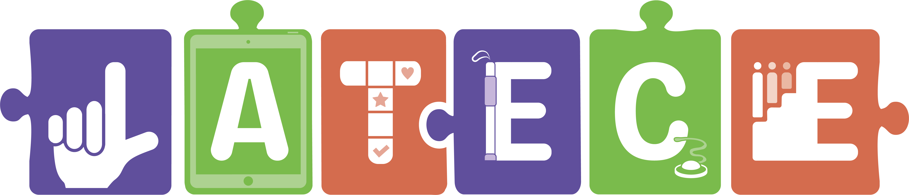
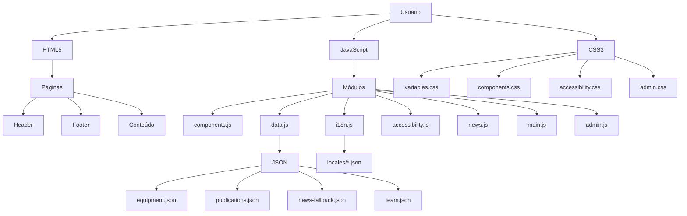
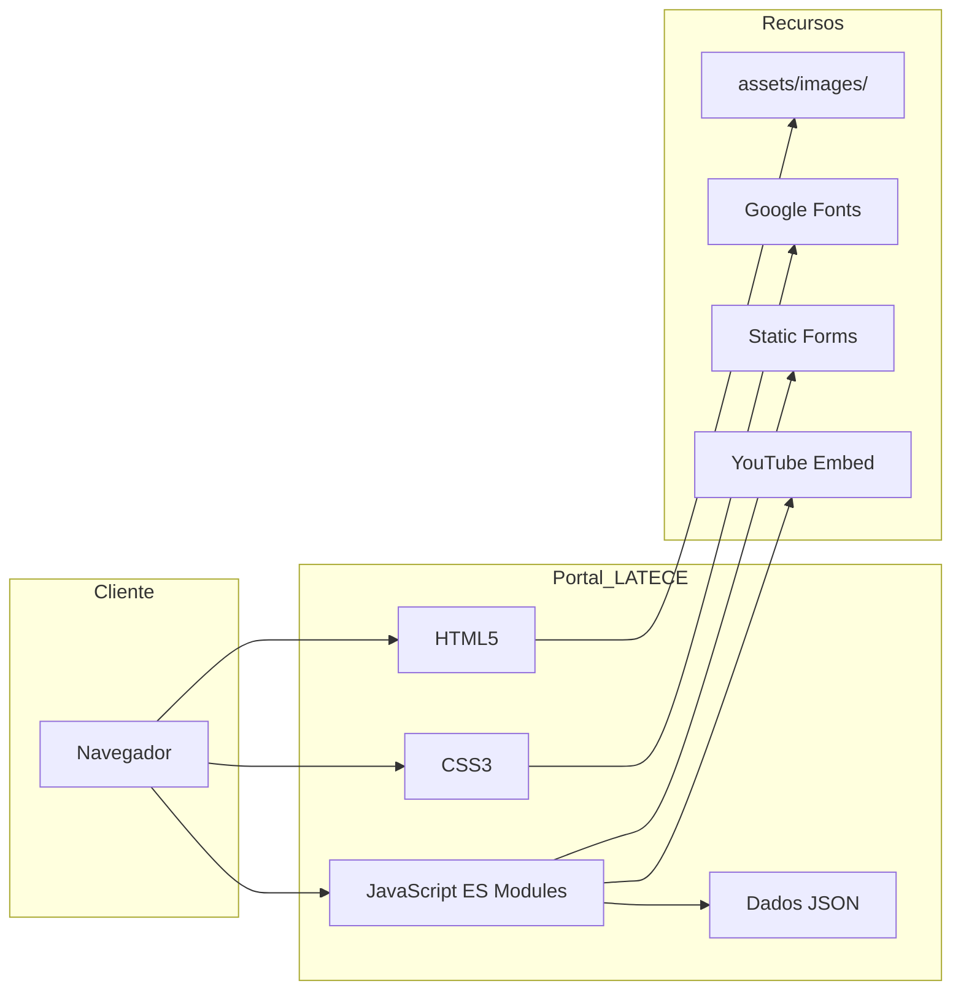
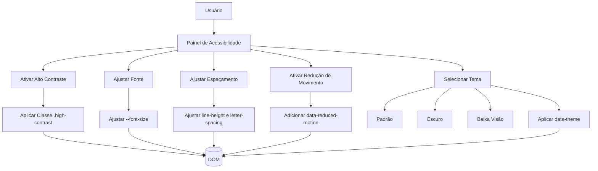

# README.md — VERSÃO REFINADA

<!--
  README.md — Portal LATECE
  Versão: 3.0 (pós‑migração e correções)
  Atualização: Setembro de 2026
  Repositório: polimatastudio/lateceufrn
  URL: https://polimatastudio.github.io/lateceufrn/
-->

<p align="center">
  
</p>

<h1 align="center">Portal LATECE</h1>

<p align="center">
  <strong>Laboratório de Tecnologia Assistiva</strong><br>
  Universidade Federal do Rio Grande do Norte — UFRN
</p>

<p align="center">
  <a href="https://github.com/polimatastudio/lateceufrn"></a>
  <a href="https://polimatastudio.github.io/lateceufrn/"></a>
  <a href="#"></a>
  <a href="#"></a>
  <a href="#"></a>
  <a href="#"></a>
  <a href="#"></a>
  <a href="#"></a>
</p>

<p align="center">
  <em>Promovendo inclusão e acessibilidade através da pesquisa, inovação e formação humana.</em>
</p>

<hr>

## 📑 Sumário

- [Visão Geral do Portal](#visão-geral-do-portal)
- [Objetivos do Projeto](#objetivos-do-projeto)
- [Funcionalidades](#funcionalidades)
- [Acessibilidade](#acessibilidade)
- [Sistema de Temas](#sistema-de-temas)
- [Identidade Visual](#identidade-visual)
- [Arquitetura Técnica](#arquitetura-técnica)
- [Estrutura do Projeto](#estrutura-do-projeto)
- [Sistema de Componentes](#sistema-de-componentes)
- [Sistema de Dados](#sistema-de-dados)
- [Internacionalização](#internacionalização)
- [Páginas e Funcionalidades](#páginas-e-funcionalidades)
- [Responsividade](#responsividade)
- [Performance](#performance)
- [SEO](#seo)
- [Segurança](#segurança)
- [GitHub Pages](#github-pages)
- [Instalação e Execução Local](#instalação-e-execução-local)
- [Desenvolvimento](#desenvolvimento)
- [Testes e Qualidade](#testes-e-qualidade)
- [Manutenção](#manutenção)
- [Guia de Extensão](#guia-de-extensão)
- [Convenções de Desenvolvimento](#convenções-de-desenvolvimento)
- [Limitações Conhecidas](#limitações-conhecidas)
- [Roadmap](#roadmap)
- [Matriz de Estado do Projeto](#matriz-de-estado-do-projeto)
- [Diagrama Geral do Sistema](#diagrama-geral-do-sistema)
- [Fluxo de Acessibilidade](#fluxo-de-acessibilidade)
- [Guia Visual](#guia-visual)
- [Documentação para Desenvolvedores](#documentação-para-desenvolvedores)
- [Documentação para Usuários](#documentação-para-usuários)
- [Créditos e Equipe](#créditos-e-equipe)
- [Contato](#contato)
- [Licença](#licença)

---

## Visão Geral do Portal

O **Portal LATECE** é o website institucional do Laboratório de Tecnologia Assistiva do Centro de Educação da Universidade Federal do Rio Grande do Norte (UFRN). O portal tem como missão divulgar as atividades, projetos, equipe e recursos do laboratório, promovendo a inclusão e a acessibilidade por meio da Tecnologia Assistiva.

O portal é um **site estático**, desenvolvido com tecnologias web padrão (HTML5, CSS3 e JavaScript Vanilla) e hospedado no GitHub Pages. Ele funciona como um ambiente de apresentação institucional, oferecendo informações, catálogos e ferramentas de interação com a comunidade acadêmica e a sociedade em geral.

| **Atributo** | **Valor** |
|--------------|-----------|
| **Nome** | LATECE — Laboratório de Tecnologia Assistiva |
| **Sigla** | LATECE |
| **Instituição** | Universidade Federal do Rio Grande do Norte (UFRN) — Centro de Educação |
| **Natureza** | Website institucional estático |
| **Repositório** | [polimatastudio/lateceufrn](https://github.com/polimatastudio/lateceufrn) |
| **URL de produção** | [https://polimatastudio.github.io/lateceufrn/](https://polimatastudio.github.io/lateceufrn/) |
| **Tecnologias** | HTML5, CSS3, JavaScript (ES Modules), JSON |
| **Hospedagem** | GitHub Pages (subdiretório `/lateceufrn/`) |
| **Versão atual** | 3.0 (pós‑migração e correções) |
| **Última atualização** | Setembro de 2026 |

---

## Objetivos do Projeto

### Objetivo Geral

Disponibilizar um portal institucional que divulgue as atividades, projetos, recursos e a equipe do LATECE, promovendo a acessibilidade, a inclusão e a democratização do conhecimento em Tecnologia Assistiva.

### Objetivos Específicos

| **Objetivo** | **Descrição** |
|--------------|---------------|
| **Divulgação institucional** | Apresentar informações sobre o laboratório, sua missão, visão e histórico. |
| **Apresentação da equipe** | Exibir os membros do LATECE (coordenação, colaboradores, pesquisadores, bolsistas) com fotos e links para currículos Lattes. |
| **Catálogo de equipamentos** | Disponibilizar um acervo de recursos de Tecnologia Assistiva, com imagens, descrições e opções de download (quando aplicável). |
| **Repositório de publicações** | Listar artigos, teses, dissertações, capítulos e outros materiais produzidos pelo laboratório. |
| **Divulgação de notícias** | Publicar notícias, eventos e avisos relacionados ao LATECE e à área de Tecnologia Assistiva. |
| **Canal de sugestões** | Oferecer um formulário para que a comunidade possa enviar ideias, críticas e contribuições. |
| **Acessibilidade e inclusão** | Garantir que o portal seja acessível a todos, independentemente de suas habilidades ou condições. |
| **Recursos assistivos** | Integrar mecanismos de ajuste de contraste, fonte, espaçamento e temas para atender diferentes necessidades. |
| **Gestão de conteúdo** | Fornecer um painel administrativo (em modo de leitura, com dependência de backend) para eventual administração. |

---

## Funcionalidades

O portal oferece as seguintes funcionalidades, organizadas por área:

### 🌐 Portal Público

| Funcionalidade | Estado | Observações |
|----------------|--------|-------------|
| **Página Inicial** | ✅ Implementado | Apresenta hero, missão, carrossel de notícias e acesso rápido. |
| **Sobre o LATECE** | ✅ Implementado | Informações institucionais, missão, visão, objetivos e justificativa. |
| **Equipe** | ✅ Implementado | Lista de membros com fotos, funções e links para Lattes. Cards com tamanho padronizado. |
| **Equipamentos** | ✅ Implementado | Catálogo com filtros (categoria e busca), paginação e modais de detalhes. |
| **Publicações** | ✅ Implementado | Lista com filtros (tipo, ano, busca), paginação e modais de detalhes. |
| **Notícias** | ✅ Implementado | Listagem com filtros, paginação e página de detalhe (com suporte a vídeo). |
| **Sugestões** | ✅ Implementado | Formulário de envio com validação e integração com Static Forms. |
| **Termos de Uso** | ✅ Implementado | Documento legal institucional. |
| **Política de Privacidade** | ✅ Implementado | Documento com transparência sobre tratamento de dados. |
| **Créditos** | ✅ Implementado | Equipe de desenvolvimento e instituições parceiras. |
| **Página 404** | ✅ Implementado | Página de erro personalizada com redirecionamento. |

### 🔐 Painel Administrativo

| Funcionalidade | Estado | Observações |
|----------------|--------|-------------|
| **Login** | ✅ Implementado | Autenticação com fallback para credenciais fixas (admin/admin123) quando a API não está disponível. |
| **Dashboard** | ✅ Implementado | Visão geral com estatísticas mock. |
| **Gerenciar Notícias** | 🟡 Modo de leitura | Listagem de notícias com filtros e ações (visualizar, editar, publicar, excluir). As operações de escrita dependem de backend. |
| **Criar/Editar Notícia** | 🟡 Modo de leitura | Formulário para criação/edição; em produção, opera em modo de leitura (fallback). |
| **Criar Usuário** | 🟡 Modo de leitura | Disponível apenas para administradores; depende de backend. |

---

## Acessibilidade

O portal foi projetado com a acessibilidade como um dos pilares centrais, buscando atender às diretrizes da **WCAG 2.2** sempre que possível. Todos os recursos descritos abaixo estão **implementados e funcionais**.

| Recurso | Implementação | Funcionalidade | Observações |
|---------|---------------|----------------|-------------|
| **Skip link** | `.skip-link` no topo de cada página | Pular diretamente para o conteúdo principal | ✅ Funcional, visível ao foco. |
| **Foco visível** | `:focus-visible` com outline | Indicar elemento focado pelo teclado | ✅ Definido globalmente. |
| **ARIA** | Atributos em componentes dinâmicos | Melhorar semântica para leitores de tela | 🟡 Presente, mas não auditado completamente. |
| **Painel de acessibilidade** | `accessibility.js` + `accessibility.css` | Controles de contraste, fonte, espaçamento, temas e movimento | ✅ Funcional. |
| **Alto contraste** | Classe `.high-contrast` | Aumentar contraste das cores | ✅ Ativo via painel. |
| **Tema escuro** | `data-theme="dark"` | Fundo escuro com superfícies hierárquicas | ✅ Implementado e refinado. |
| **Tema baixa visão** | `data-theme="low-vision"` | Aumento de fonte e ajustes de contraste | 🟡 Definido, mas não testado exaustivamente. |
| **Redução de movimento** | `prefers-reduced-motion` + toggle | Desativar animações | ✅ Respeita preferência do sistema e permite toggle. |
| **Ajuste de fonte** | Slider no painel | Aumentar/diminuir tamanho da fonte (14px–24px) | ✅ Persiste em localStorage. |
| **Espaçamento (line-height, letter-spacing)** | Sliders no painel | Ajustar espaçamento entre linhas e letras | ✅ Persiste em localStorage. |
| **Semântica HTML** | Uso de tags semânticas (`header`, `main`, `footer`, `section`, `article`, `nav`) | Estrutura clara e acessível | ✅ Boa semântica. |
| **Textos alternativos** | `alt` em imagens, `aria-label` em ícones | Descrição de conteúdo não textual | 🟡 Presente, mas pode haver omissões. |
| **Contraste** | (não formalmente testado) | — | ⚪ Recomenda-se auditoria com ferramentas (WAVE, axe). |

---

## Sistema de Temas

O projeto implementa um sistema de temas baseado em **variáveis CSS** e no atributo `data-theme`, permitindo a alternância entre diferentes aparências visuais.

### Como funciona

1. O atributo `data-theme` é aplicado ao elemento `<html>`.
2. As variáveis CSS (definidas em `variables.css`) são sobrescritas no seletor `[data-theme="..."]`.
3. O JavaScript (`accessibility.js`) gerencia a persistência da escolha via `localStorage` e a aplicação dinâmica.

### Temas disponíveis

| Tema | Identificador | Status | Descrição |
|------|---------------|--------|-----------|
| **Padrão (Claro)** | `default` | ✅ Funcional | Fundo claro, cores institucionais. |
| **Escuro** | `dark` | ✅ Funcional | Fundo escuro com hierarquia de superfícies e contraste otimizado. |
| **Baixa Visão** | `low-vision` | 🟡 Parcial | Aumento de fonte e ajustes de contraste. |
| **Alto Contraste** | `.high-contrast` (classe) | ✅ Funcional | Contraste máximo, fundo preto e branco. |

### Exemplo de definição de variáveis

```css
:root {
  --bg: #ffffff;
  --text: #1a1a2e;
  --surface: #ffffff;
  --border: #e2e0e8;
}

[data-theme="dark"] {
  --bg: #10111F;
  --text: #F7F5FF;
  --surface: #242842;
  --border: #51577D;
}

---

## Identidade Visual

A identidade visual do LATECE é baseada em uma paleta de cores que reflete a seriedade, a inovação e o compromisso com a acessibilidade. O sistema de design está documentado em `variables.css` e aplicado globalmente.

### Paleta de Cores

| Função | Cor (Claro) | Cor (Escuro) | Uso |
|--------|-------------|--------------|-----|
| **Primária** | `#2E1065` | `#B9A3FF` | Ações principais, links, destaques |
| **Primária (light)** | `#7C3AED` | `#D0C3FF` | Hovers, links sobre fundos escuros |
| **Primária (dark)** | `#1A0A3A` | `#8F73E6` | Gradientes, estados ativos |
| **Secundária** | `#928B45` | `#E6C76B` | Badges, categorias, ícones |
| **Acento** | `#C77A5B` | `#E6A078` | Chamadas, elementos decorativos |
| **Sucesso** | `#2E7D32` | `#69D391` | Mensagens de sucesso |
| **Aviso** | `#B76E2E` | `#F0C674` | Alertas e avisos |
| **Erro** | `#C62828` | `#FF8585` | Mensagens de erro |
| **Fundo global** | `#FFFFFF` | `#10111F` | Body e áreas principais |
| **Superfície** | `#FFFFFF` | `#242842` | Cards, formulários, blocos |
| **Superfície elevada** | `#F9F9FB` | `#2D3150` | Modais, dropdowns, tooltips |
| **Texto principal** | `#1A1A2E` | `#F7F5FF` | Títulos e conteúdo principal |
| **Texto secundário** | `#4D4A6E` | `#D7D3E8` | Descrições, metadados |
| **Texto muted** | `#6B6788` | `#AAA6C2` | Informações auxiliares |
| **Borda** | `#E2E0E8` | `#51577D` | Divisores e limites de componentes |
| **Borda forte** | `#C8C5D4` | `#737AA6` | Controles e limites funcionais |

### Tipografia

- **Títulos**: `'Montserrat', sans-serif` (pesos 400–800)
- **Corpo**: `'Open Sans', sans-serif` (pesos 400–700)
- **Escala**: `0.75rem` a `3.5rem`, com clareza hierárquica.

### Componentes visuais

- **Cards**: `border-radius: 16px`, `box-shadow` suave, hover com elevação.
- **Botões**: `border-radius: 8px`, transições suaves, estados hover/focus/active.
- **Hero**: Gradientes e formas orgânicas, com alto contraste.
- **Ícones**: Utilizados para ações e informações complementares.

---

## Arquitetura Técnica

O portal LATECE é uma **aplicação estática com componentes dinâmicos**, construída com tecnologias web padrão, sem frameworks ou bibliotecas externas.

### Diagrama de Arquitetura



### Tecnologias Utilizadas

| Tecnologia | Uso |
|------------|-----|
| **HTML5** | Estrutura semântica das páginas |
| **CSS3** | Estilização, variáveis, temas, responsividade |
| **JavaScript (ES Modules)** | Lógica, componentes, interatividade, carregamento de dados |
| **JSON** | Dados de conteúdo (equipe, equipamentos, publicações, notícias) e traduções |
| **GitHub Pages** | Hospedagem e publicação do site estático |

### Organização dos Módulos JavaScript

O código JavaScript é organizado em módulos ES, permitindo reutilização e manutenção facilitada.

| Módulo | Finalidade |
|--------|------------|
| `path.js` | Resolução de caminhos para compatibilidade com GitHub Pages (subdiretório). |
| `main.js` | Ponto de entrada para o site público. |
| `components.js` | Fábrica de componentes HTML (header, footer, cards, modais, paginação). |
| `data.js` | Carregamento de dados JSON com fallback. |
| `i18n.js` | Internacionalização (carregamento de traduções, aplicação ao DOM). |
| `accessibility.js` | Painel de acessibilidade, temas, preferências. |
| `news.js` | Lógica específica para notícias (fetch, filtros, paginação). |
| `admin.js` | Painel administrativo (SPA, com roteador). |
| `auth.js` | Autenticação (fallback para credenciais fixas). |
| `router.js` | Roteamento SPA para o painel administrativo. |

---

## Estrutura do Projeto

A árvore abaixo representa a estrutura de diretórios e os principais arquivos do projeto, com base na versão atual.

```
lateceufrn/
├── .nojekyll                 # Impede processamento Jekyll no GitHub Pages
├── 404.html                  # Página de erro personalizada
├── about.html                # Página "Sobre"
├── creditos.html             # Créditos
├── equipment.html            # Catálogo de equipamentos
├── index.html                # Página inicial (Home)
├── login.html                # Login para o painel administrativo
├── news-detail.html          # Detalhe de notícia
├── news.html                 # Lista de notícias
├── politica-de-privacidade.html # Política de Privacidade
├── publications.html         # Repositório de publicações
├── sugestoes.html            # Formulário de sugestões
├── team.html                 # Página da equipe
├── termos-de-uso.html        # Termos de Uso
├── admin/
│   └── index.html            # Painel administrativo (SPA)
├── assets/
│   ├── downloads/            # Arquivos para download (APK, PDF, etc.)
│   ├── images/
│   │   ├── equipment/        # Imagens dos equipamentos
│   │   ├── illustrations/    # Ilustrações e placeholders
│   │   ├── icons/            # Ícones (Instagram, YouTube, Lattes)
│   │   ├── logos/            # Logotipos e favicon
│   │   ├── news/             # Imagens de notícias
│   │   └── team/             # Fotos da equipe
├── css/
│   ├── accessibility.css     # Estilos do painel de acessibilidade e temas
│   ├── admin.css             # Estilos do painel administrativo
│   ├── base.css              # Estilos base
│   ├── components.css        # Sistema visual de componentes
│   ├── layout.css            # Grid e layout
│   ├── reset.css             # Reset CSS
│   ├── utilities.css         # Classes utilitárias
│   └── variables.css         # Design tokens (cores, tipografia, espaçamento)
├── data/
│   ├── equipment.json        # Dados dos equipamentos
│   ├── news-fallback.json    # Notícias (fallback)
│   ├── publications.json     # Dados das publicações
│   └── team.json             # Dados da equipe
├── js/
│   ├── accessibility.js      # Controles de acessibilidade
│   ├── admin.js              # Lógica do painel administrativo (SPA)
│   ├── auth.js               # Autenticação
│   ├── components.js         # Fábrica de componentes HTML
│   ├── data.js               # Carregamento de dados JSON
│   ├── i18n.js               # Internacionalização
│   ├── main.js               # Ponto de entrada do site público
│   ├── news.js               # Lógica de notícias
│   ├── path.js               # Resolução de caminhos
│   └── router.js             # Roteamento SPA para admin
└── locales/
    ├── en.json               # Traduções para inglês
    ├── es.json               # Traduções para espanhol
    └── pt.json               # Traduções para português
```

### Explicação dos Diretórios

| Diretório/Arquivo | Responsabilidade |
|-------------------|------------------|
| **`css/`** | Todos os estilos do projeto, organizados por responsabilidade. |
| **`js/`** | Código JavaScript modular (ES Modules). |
| **`data/`** | Arquivos JSON com dados de conteúdo (equipe, equipamentos, publicações, notícias). |
| **`locales/`** | Arquivos de tradução para os idiomas suportados. |
| **`assets/`** | Recursos estáticos: imagens, ícones, logotipos, arquivos para download. |
| **`admin/`** | Arquivos do painel administrativo. |
| **`.nojekyll`** | Arquivo de configuração para GitHub Pages, impedindo o processamento Jekyll. |

---

## Sistema de Componentes

O portal utiliza um sistema de componentes reutilizáveis, implementados em JavaScript (via `components.js`) e estilizados globalmente. Os componentes são injetados dinamicamente nas páginas, garantindo consistência e facilitando a manutenção.

### Componentes Principais

| Componente | Função | Páginas | Dependências |
|------------|--------|---------|--------------|
| **Header** | Barra superior com navegação, logo e seletor de idioma. | Todas | `components.js`, `i18n.js`, `path.js` |
| **Footer** | Rodapé com informações institucionais, links e mapa. | Todas | `components.js`, `path.js` |
| **TeamCard** | Exibe membro da equipe com foto, nome, função, instituição e ícone Lattes. | Team | `components.js`, `i18n.js` |
| **EquipmentCard** | Exibe equipamento com imagem, categoria, descrição e download. | Equipment | `components.js`, `i18n.js`, `path.js` |
| **PublicationItem** | Exibe publicação com resumo, autores, ano e ações. | Publications | `components.js`, `i18n.js` |
| **NewsCard** | Exibe notícia com imagem/vídeo, título, resumo. | Home, News | `components.js`, `i18n.js`, `path.js` |
| **NewsDetail** | Exibe conteúdo completo de uma notícia. | News Detail | `components.js`, `i18n.js`, `path.js` |
| **Carousel** | Loop infinito de notícias na Home. | Home | `components.js`, `news.js` |
| **Pagination** | Navegação entre páginas de listas. | Equipment, Publications, News | `components.js` |
| **Modal** | Sobreposição para detalhes de equipamentos/publicações. | Equipment, Publications | `components.js`, `i18n.js`, `path.js` |
| **AccessibilityPanel** | Controles de acessibilidade (contraste, fonte, temas). | Todas | `accessibility.js` |
| **LanguageSelector** | Seletor de idioma (dropdown). | Todas | `main.js`, `i18n.js` |
| **BackToTop** | Botão para voltar ao topo da página. | Todas | `main.js` |

---

## Sistema de Dados

Os dados de conteúdo são armazenados em arquivos JSON localizados no diretório `data/`. Eles são carregados via `fetch` utilizando a função `resolvePath` (do módulo `path.js`) para garantir caminhos corretos em qualquer ambiente (subdiretório).

### Arquivos JSON

| Arquivo | Finalidade | Chave principal | Consumidores |
|---------|------------|-----------------|--------------|
| `team.json` | Dados da equipe | `members` | `data.js` → `loadTeamData()` |
| `equipment.json` | Catálogo de equipamentos | `items` | `data.js` → `loadEquipmentData()` |
| `publications.json` | Repositório de publicações | `items` | `data.js` → `loadPublicationsData()` |
| `news-fallback.json` | Notícias (fallback) | `items` | `data.js` → `loadNewsFallback()` |

### Exemplo de Estrutura (team.json)

```json
{
  "version": "1.0.0",
  "updatedAt": "2026-09-03T00:00:00Z",
  "members": [
    {
      "id": 1,
      "name": "Débora Nunes",
      "role": "coordinator",
      "roleLabel": "Coordenadora Geral",
      "photoUrl": "assets/images/team/debora.jpeg",
      "lattesUrl": "http://lattes.cnpq.br/1188086132826132",
      "order": 0,
      "institution": "UFRN",
      "showPhoto": true
    }
  ]
}
```

### Carregamento e Fallback

Todos os dados são carregados via `data.js`, que utiliza `fetch` com `resolvePath`. Em caso de erro de carregamento, a função retorna um array vazio, garantindo que a interface não quebre.

---

## Internacionalização

O portal suporta três idiomas: **Português (pt)**, **Inglês (en)** e **Espanhol (es)**. A internacionalização é gerenciada pelo módulo `i18n.js`, que carrega arquivos de tradução JSON e aplica dinamicamente ao DOM sem modificar a URL.

### Arquivos de Tradução

- `locales/pt.json` — Português
- `locales/en.json` — Inglês
- `locales/es.json` — Espanhol

### Mecanismo

1. O idioma é detectado a partir de `localStorage` ou do navegador.
2. O arquivo de tradução correspondente é carregado via `fetch` (com `resolvePath`).
3. Os elementos HTML com os atributos `data-i18n`, `data-i18n-placeholder`, `data-i18n-aria-label` e `data-i18n-title` são traduzidos automaticamente.
4. O seletor de idioma (dropdown) permite a troca manual, persistindo a escolha em `localStorage`.

### Exemplo de Uso

```html
<h1 data-i18n="home.title">Portal LATECE</h1>
<input type="text" data-i18n-placeholder="search.placeholder" placeholder="Buscar...">
<button data-i18n="nav.home">Início</button>
```

---

## Páginas e Funcionalidades

### 1. Página Inicial (index.html)

- **Hero**: Chamada principal com estatísticas (fundação, pesquisadores, projetos).
- **Missão**: Bloco com a missão do LATECE.
- **Carrossel de Notícias**: Loop infinito das últimas notícias.
- **Acesso Rápido**: Links para Sobre, Equipamentos e Publicações.

### 2. Sobre (about.html)

- **Quem Somos**: História e descrição do laboratório.
- **Missão e Visão**: Cards com a missão e visão.
- **Objetivos Estratégicos**: Lista de objetivos com ícones.
- **Justificativa**: Textos explicativos.
- **Nosso Diferencial**: Card destacado.

### 3. Equipe (team.html)

- Lista de membros organizados por categoria (Coordenação, Equipe Técnica, Bolsistas, Pesquisadores Parceiros, Colaboradores, Desenvolvedores).
- Cada membro é exibido em um card com foto (ou iniciais), nome, função, instituição e ícone do Lattes (link para currículo).
- Cards com tamanho padronizado (altura mínima 360px, largura máxima 320px).

### 4. Equipamentos (equipment.html)

- Catálogo com filtros (busca por nome/descrição, categoria).
- Paginação (10 itens por página).
- Cards com imagem, nome, categoria, descrição e botão de download (quando disponível).
- Modal com detalhes adicionais.

### 5. Publicações (publications.html)

- Lista com filtros (busca, tipo, ano).
- Paginação (10 itens por página).
- Cards com título, autores, ano, resumo e ações (ver detalhes, download/acessar).

### 6. Notícias (news.html e news-detail.html)

- **Listagem**: Filtros (busca, categoria), paginação (10 itens por página).
- **Detalhe**: Conteúdo completo, com suporte a vídeo (YouTube), tags e links relacionados.
- **Carrossel na Home**: Loop infinito das últimas notícias.

### 7. Sugestões (sugestoes.html)

- Formulário com campos: categoria, título, descrição, impacto, relação com acessibilidade, e-mail.
- Validação no lado do cliente.
- Envio via API Static Forms.
- Mensagens de sucesso/erro.

### 8. Termos de Uso e Política de Privacidade

- Documentos institucionais com conteúdo estático.

### 9. Painel Administrativo (admin/index.html)

- **Login**: Autenticação com fallback para credenciais fixas (admin/admin123) quando a API não está disponível.
- **Dashboard**: Visão geral com estatísticas mock.
- **Gerenciar Notícias**: Listagem, filtros e ações (visualizar, editar, publicar, excluir). **Modo de leitura** em produção, pois as operações CRUD dependem de backend.
- **Criar/Editar Notícia**: Formulário com campos e upload de imagem. **Operações dependem de backend**.
- **Criar Usuário**: Disponível apenas para administradores. Depende de backend.

---

## Responsividade

O portal foi desenvolvido com uma abordagem **mobile-first**, utilizando breakpoints definidos no CSS para garantir uma experiência consistente em diferentes dispositivos.

| Breakpoint | Largura | Comportamento |
|------------|---------|---------------|
| **Mobile** | < 480px | Layout em coluna única, menu hambúrguer, ajustes de espaçamento. |
| **Tablet** | 480px – 768px | Grids com 2 colunas, ajustes de tipografia. |
| **Desktop** | 768px – 1024px | Grids com 3 ou 4 colunas, navegação completa. |
| **Wide** | > 1024px | Conteúdo centralizado com largura máxima. |

### Principais Adaptações

- **Header**: Top bar oculta em dispositivos móveis. Menu hambúrguer com overlay.
- **Cards**: Grids responsivos com `auto-fit` e `minmax`.
- **Carrossel**: Máscara lateral removida em mobile, adaptação de tamanho dos cards.
- **Formulários**: Campos em largura total, empilhamento vertical.
- **Tipografia**: Tamanhos ajustados via `clamp()`.

---

## Performance

O portal é leve e rápido, utilizando técnicas de otimização para melhorar a experiência do usuário.

| Aspecto | Estratégia | Impacto |
|---------|------------|---------|
| **JavaScript** | Módulos ES, carregamento assíncrono (type="module") | Menor tempo de bloqueio. |
| **CSS** | 8 arquivos, carregamento síncrono no `<head>` | Renderização bloqueante, mas leve. |
| **Imagens** | Lazy loading (atributo `loading="lazy"`) | Redução de carregamento inicial. |
| **Fontes** | Google Fonts com `preconnect` | Acelera carregamento de fontes. |
| **Carrossel** | Animação infinita com `prefers-reduced-motion` | Respeita preferências do usuário. |

### Recomendações de Melhoria

- Minificar CSS e JavaScript para produção.
- Utilizar `loading="lazy"` para imagens fora da viewport (já parcialmente aplicado).
- Implementar um sistema de cache para dados JSON.

---

## SEO

O portal foi estruturado com boas práticas de SEO para melhorar a visibilidade em mecanismos de busca.

| Prática | Implementação |
|---------|---------------|
| **Títulos** | Definidos com `data-i18n-title` (dinâmico) ou `<title>` estático. |
| **Meta descrições** | Presentes em todas as páginas. |
| **Open Graph** | Tags `og:title`, `og:description`, `og:image` em todas as páginas. |
| **Twitter Cards** | Tags `twitter:card`, `twitter:title`, `twitter:description`, `twitter:image`. |
| **Canonical** | `link rel="canonical"` em todas as páginas. |
| **Heading hierarchy** | Uso consistente de `h1`, `h2`, `h3`, `h4`. |
| **Estrutura semântica** | HTML semântico (`article`, `section`, `nav`, `header`, `footer`). |
| **Dados estruturados** | JSON-LD para notícias (injetado dinamicamente). |

### Pendências de SEO

- Sitemap XML não encontrado.
- Robots.txt não encontrado.

---

## Segurança

O portal, por ser estático, apresenta riscos limitados. No entanto, foram adotadas medidas para garantir a segurança básica.

| Aspecto | Implementação | Observação |
|---------|---------------|------------|
| **innerHTML** | Usado em componentes (dados de JSON confiável) | Risco baixo, pois os dados são locais. |
| **eval** | Não utilizado | — |
| **Formulários** | Validação no cliente; envio para API externa (Static Forms) | Dados não sensíveis. |
| **APIs externas** | Apenas Static Forms e YouTube (embeds) | Sem chaves expostas. |
| **localStorage** | Preferências de usuário (idioma, acessibilidade, tema), token JWT | Token armazenado em localStorage (risco XSS, mas ambiente estático). |
| **XSS** | Potencial em `createNewsDetail` com `news.content` | Recomenda-se sanitizar ou confiar que o JSON é seguro. |

### Recomendações

- Sanitizar dados de `news.content` antes de usar `innerHTML`.
- Utilizar `textContent` sempre que possível.
- Revisar a exposição de tokens em localStorage.

---

## GitHub Pages

O portal é publicado no **GitHub Pages**, utilizando o subdiretório `/lateceufrn/` como base. A configuração inclui:

- **Arquivo `.nojekyll`**: Impede o processamento Jekyll, garantindo que arquivos e pastas com underscore não sejam ignorados.
- **Mecanismo de caminhos**: `path.js` define `BASE_PATH` e a função `resolvePath()`, garantindo que todos os recursos (imagens, CSS, JS, JSON) sejam carregados corretamente, independentemente do subdiretório.
- **Página 404**: Personalizada, com redirecionamento para o subdiretório.

### URL de Produção

[https://polimatastudio.github.io/lateceufrn/](https://polimatastudio.github.io/lateceufrn/)

### Publicação Futura

Embora atualmente hospedado no GitHub Pages, o projeto é preparado para ser publicado em um domínio institucional da UFRN. Para isso, basta ajustar o `BASE_PATH` ou remover o prefixo e atualizar os caminhos relativos.

---

## Instalação e Execução Local

### Pré-requisitos

- Navegador web moderno (Chrome, Firefox, Edge, Safari)
- (Opcional) Servidor HTTP local para desenvolvimento

### Método Recomendado

O projeto utiliza módulos ES (`type="module"`) e `fetch` para carregar arquivos JSON. Portanto, **não é recomendado abrir os arquivos HTML diretamente no navegador** (via `file://`), pois isso pode causar erros de CORS e de carregamento de módulos.

Utilize um servidor HTTP local. Exemplos:

#### Python 3

```bash
# No diretório raiz do projeto
python3 -m http.server 8000
```

#### Node.js (http-server)

```bash
# Instalação global (uma vez)
npm install -g http-server

# No diretório raiz do projeto
http-server -p 8000
```

#### VS Code (Live Server)

Instale a extensão "Live Server" e clique em "Go Live" no canto inferior direito.

#### PHP (integrado)

```bash
php -S localhost:8000
```

Após iniciar o servidor, acesse `http://localhost:8000` no navegador.

---

## Desenvolvimento

### Fluxo de Trabalho

1. **Clone o repositório**

```bash
git clone https://github.com/polimatastudio/lateceufrn.git
cd lateceufrn
```

2. **Execute um servidor local** (conforme descrito acima).

3. **Edite os arquivos** (HTML, CSS, JS, JSON) conforme necessário.

4. **Teste as alterações**:
   - Verifique a console do navegador para erros.
   - Teste a responsividade (Chrome DevTools).
   - Teste a acessibilidade (painel de acessibilidade, teclado, leitores de tela).

5. **Valide os caminhos**: Certifique-se de que todos os recursos estão sendo carregados corretamente com `resolvePath`.

6. **Publique** (se aplicável):
   - Faça o commit e push para o repositório.
   - O GitHub Pages publicará automaticamente a partir da branch principal.

### Cuidados ao Desenvolver

- **Use `resolvePath()` sempre que referenciar um recurso interno** (CSS, JS, imagens, JSON).
- **Não use caminhos absolutos** (ex: `/assets/...`).
- **Mantenha a identidade visual**: cores, tipografia, espaçamentos devem permanecer consistentes.
- **Respeite a acessibilidade**: não remova atributos ARIA ou recursos do painel.
- **Teste em múltiplos navegadores e dispositivos**.

---

## Testes e Qualidade

### Testes Realizados

| Tipo | Cobertura | Status | Observações |
|------|-----------|--------|-------------|
| **Navegação manual** | Todas as páginas | ✅ | Links e menus funcionam. |
| **Responsividade** | Mobile, tablet, desktop | ✅ | Breakpoints funcionais. |
| **Paginação** | Equipamentos, Publicações, Notícias | ✅ | Funciona em todos os níveis. |
| **Filtros** | Busca e categoria/tipo/ano | ✅ | Funcionam. |
| **Internacionalização** | pt, en, es | ✅ | Traduções aplicadas; seletor corrigido. |
| **Acessibilidade básica** | Teclado, foco, painel | ✅ | Funcional. |
| **GitHub Pages** | Caminhos, 404, assets | ✅ | Site publicado e navegável. |
| **Formulário de sugestões** | Envio via Static Forms | ✅ | Funciona com validação e feedback. |
| **Admin** | Modo de leitura | 🟡 | Funcionalidades CRUD não testadas (back-end ausente). |

### Testes Recomendados (Futuros)

- Auditoria de contraste com ferramentas (WAVE, axe DevTools).
- Testes com leitores de tela (NVDA, VoiceOver).
- Avaliação de performance com Lighthouse.
- Testes de segurança (XSS, CSRF).

---

## Manutenção

### Onde Alterar

| Área | Arquivo | Instruções |
|------|---------|------------|
| **Cores e temas** | `css/variables.css` | Ajuste as variáveis CSS no bloco `:root` (claro) e `[data-theme="dark"]` (escuro). |
| **Tipografia** | `css/variables.css` | Altere as variáveis de fonte e tamanho. |
| **Menu de navegação** | `js/components.js` (header) | Atualize a lista de links no `createHeader()`. |
| **Notícias** | `data/news-fallback.json` | Adicione ou modifique itens; siga a estrutura existente. |
| **Equipamentos** | `data/equipment.json` | Adicione ou modifique itens; siga a estrutura existente. |
| **Publicações** | `data/publications.json` | Adicione ou modifique itens; siga a estrutura existente. |
| **Equipe** | `data/team.json` | Adicione ou modifique membros; siga a estrutura existente. |
| **Traduções** | `locales/*.json` | Adicione ou modifique chaves de tradução. |
| **Imagens** | `assets/images/` | Adicione imagens nos diretórios correspondentes. |
| **Arquivos para download** | `assets/downloads/` | Adicione arquivos (APK, PDF, etc.) e atualize o JSON. |
| **Componentes globais** | `js/components.js`, `css/components.css` | Modifique com cuidado, pois afetam todas as páginas. |

### Passos para Adicionar uma Nova Notícia

1. Abra `data/news-fallback.json`.
2. Adicione um novo objeto no array `items` com os campos: `id`, `title`, `excerpt`, `content`, `category`, `createdAt`, `imageUrl`, `status`, `isVideo` (opcional), `videoUrl` (opcional), `links` (opcional).
3. Salve o arquivo.
4. A notícia aparecerá automaticamente na listagem, no carrossel da Home e na página de detalhe.

### Passos para Adicionar um Novo Membro da Equipe

1. Abra `data/team.json`.
2. Adicione um novo objeto no array `members` com os campos: `id`, `name`, `role`, `roleLabel`, `photoUrl`, `lattesUrl`, `order`, `institution`, `showPhoto`.
3. Coloque a foto (se houver) em `assets/images/team/`.
4. Salve o arquivo.
5. O membro aparecerá automaticamente na página Equipe, na categoria correspondente ao `role`.

---

## Guia de Extensão

### Adicionar um Novo Tema

1. Defina as variáveis no `variables.css` sob um novo seletor, ex: `[data-theme="new-theme"]`.
2. Adicione a opção no seletor de temas (painel de acessibilidade) em `accessibility.js`.
3. Atualize a função `setTheme` e o `localStorage` se necessário.

### Adicionar um Novo Idioma

1. Crie um novo arquivo de tradução em `locales/` (ex: `fr.json`).
2. Adicione o idioma à lista de opções em `main.js` (`setupLanguageSelector`).
3. Atualize a detecção de idioma em `i18n.js`.

### Adicionar um Novo Componente

1. Crie a função no `components.js` que retorne o HTML do componente.
2. Adicione os estilos correspondentes no `components.css`.
3. Importe e use a função em `main.js` ou `admin.js`.

### Adicionar uma Nova Página

1. Crie o arquivo HTML na raiz.
2. Inclua a estrutura base (header, footer, conteúdo).
3. Adicione a página ao menu de navegação em `components.js`.
4. (Opcional) Adicione lógica de carregamento de dados em `main.js`.

---

## Convenções de Desenvolvimento

### Nomenclatura

- **HTML**: Classes em `kebab-case` (ex: `team-card`, `quick-access`).
- **CSS**: Variáveis em `--kebab-case` (ex: `--color-primary`).
- **JavaScript**: Funções em `camelCase` (ex: `loadTeamData`), arquivos em `kebab-case` (ex: `components.js`).
- **JSON**: Chaves em `camelCase` (ex: `photoUrl`, `roleLabel`).

### Organização de CSS

- **Temas**: Definidos em `variables.css` via `:root` e `[data-theme="..."]`.
- **Componentes**: Estilos em `components.css`, com seções comentadas.
- **Acessibilidade**: Estilos em `accessibility.css`.
- **Utilitários**: Em `utilities.css`.

### JavaScript Modules

- Use `import` e `export` para organizar o código.
- Cada módulo deve ter uma responsabilidade clara.
- Funções devem ser documentadas com JSDoc (recomendado).

---

## Limitações Conhecidas

| Limitação | Descrição | Impacto |
|-----------|-----------|---------|
| **Admin sem backend** | O painel administrativo opera em modo de leitura; as operações CRUD (criar, editar, excluir) dependem de uma API que não existe no ambiente de produção. | Baixo (para uso público); alto (para administração). |
| **Modais sem aprisionamento de foco** | O foco não fica restrito ao modal quando aberto. | Médio (acessibilidade). |
| **Páginas legais não traduzidas** | Termos de Uso e Política de Privacidade não possuem atributos `data-i18n`. | Baixo (conteúdo estático em português). |
| **VLibras ausente** | Não há integração com o VLibras (Libras). | Médio (acessibilidade para surdos). |
| **Sitemap e robots.txt ausentes** | Não há arquivos de SEO complementares. | Baixo. |
| **Contraste não testado formalmente** | Não foram realizados testes formais de contraste com ferramentas. | Médio (acessibilidade). |

---

## Roadmap

| Funcionalidade | Status | Prioridade |
|----------------|--------|------------|
| **Aprisionamento de foco em modais** | 📋 Planejado | Alta |
| **VLibras** | 📋 Planejado | Média |
| **Sitemap e robots.txt** | 📋 Planejado | Baixa |
| **Testes de contraste e leitores de tela** | 📋 Planejado | Média |
| **Temas adicionais (daltonismo, texto grande)** | 📋 Planejado | Baixa |
| **Download de arquivos (APK, PDF, etc.)** | 🟡 Pendente | Alta |
| **Painel administrativo completo (CRUD)** | 📋 Planejado | Alta (com backend) |
| **Sistema de busca global** | 📋 Planejado | Média |
| **Novos idiomas** | 📋 Planejado | Baixa |

---

## Matriz de Estado do Projeto

| Área | Estado | Observação |
|------|--------|------------|
| **Front-end** | ✅ Funcional | Todas as páginas públicas navegáveis. |
| **Acessibilidade** | ✅ Funcional | Painel de acessibilidade, temas, ajustes de fonte. |
| **Temas** | ✅ Funcional | Claro, escuro, baixa visão, alto contraste. |
| **Internacionalização** | ✅ Funcional | pt, en, es; seletor funcional. |
| **Notícias** | ✅ Funcional | Listagem, filtros, paginação, detalhe. |
| **Equipamentos** | ✅ Funcional | Catálogo, filtros, paginação, modais. |
| **Publicações** | ✅ Funcional | Listagem, filtros, paginação, modais. |
| **Equipe** | ✅ Funcional | Listagem com cards padronizados e ícone Lattes. |
| **Sugestões** | ✅ Funcional | Formulário com validação e envio. |
| **GitHub Pages** | ✅ Funcional | Publicação em subdiretório com `resolvePath`. |
| **Responsividade** | ✅ Funcional | Adaptado para mobile, tablet e desktop. |
| **SEO** | 🟡 Parcial | Tags OG e dados estruturados, mas sem sitemap. |
| **Performance** | 🟡 Parcial | Leve, mas sem minificação. |
| **Admin** | 🟡 Modo de leitura | Depende de backend para CRUD. |

---

## Diagrama Geral do Sistema



---

## Fluxo de Acessibilidade



---

## Guia Visual

### Cores Primárias

| Cor | Valor Claro | Valor Escuro | Uso |
|-----|-------------|--------------|-----|
| Primária | `#2E1065` | `#B9A3FF` | Botões principais, links |
| Primária (light) | `#7C3AED` | `#D0C3FF` | Hovers |
| Primária (dark) | `#1A0A3A` | `#8F73E6` | Gradientes |

### Tipografia

- **Títulos**: `'Montserrat', sans-serif`
- **Corpo**: `'Open Sans', sans-serif`
- **Escala**: `clamp()` para responsividade.

### Componentes

#### Cards

- **Fundo**: `var(--surface)` (branco no claro, `#242842` no escuro).
- **Borda**: 2px sólida, com cor contrastante em cada tema.
- **Border-radius**: 16px (`var(--radius-lg)`).
- **Sombra**: `var(--shadow-subtle)` com elevação no hover.
- **Hover**: `transform: translateY(-4px)`, sombra elevada e borda interativa.

#### Botões

- **Primário**: Gradiente roxo, texto branco.
- **Secundário**: Fundo `--surface`, texto roxo.
- **Outline**: Transparente, borda roxa.

#### Formulários

- **Campos**: Fundo `--control-bg`, borda `--control-border`.
- **Foco**: Borda `--border-interactive` e sombra `--focus-ring`.

---

## Documentação para Desenvolvedores

### Entendendo a Arquitetura

- **Páginas**: Cada página HTML é independente e possui seu próprio conteúdo.
- **Header e Footer**: São injetados via JavaScript (`components.js`) em todas as páginas.
- **Dados**: Carregados de JSON via `data.js` e `fetch`.
- **Temas**: Gerenciados por variáveis CSS e `data-theme`.
- **Acessibilidade**: Controlada pelo módulo `accessibility.js`.

### Arquivos Críticos

- `js/path.js`: Fundamentais para resolução de caminhos no GitHub Pages.
- `css/variables.css`: Base de todos os tokens visuais.
- `js/main.js`: Ponto de entrada do site público.
- `js/components.js`: Todos os componentes reutilizáveis.
- `js/data.js`: Carregamento de dados.
- `css/components.css`: Estilos globais de componentes.

### Cuidados ao Modificar

1. **Sempre use `resolvePath()`** para recursos internos.
2. **Não remova funcionalidades de acessibilidade**.
3. **Teste a alteração nos dois temas** (claro e escuro).
4. **Verifique a responsividade** em diferentes tamanhos de tela.
5. **Evite `!important`** sempre que possível; prefira aumentar a especificidade.

---

## Documentação para Usuários

### Como navegar

- **Menu principal**: No topo da página, com links para as principais seções.
- **Menu mobile**: Acessível pelo ícone de hambúrguer em telas pequenas.
- **Voltar ao topo**: Clique no botão ↑ no canto inferior direito.

### Como usar a acessibilidade

1. Clique no ícone ♿ no canto inferior direito.
2. No painel que se abre, você pode:
   - **Trocar o tema** (Padrão, Escuro, Baixa Visão).
   - **Ativar Alto Contraste**.
   - **Ajustar o tamanho da fonte** (A+, A-, Reset).
   - **Ajustar espaçamento** (linhas e letras).
   - **Ativar Redução de Movimento**.

### Como consultar equipamentos

- Acesse a página "Equipamentos".
- Use a barra de busca para encontrar um equipamento específico.
- Filtre por categoria.
- Clique no card para ver detalhes (imagem, descrição completa).
- Se disponível, clique em "Baixar" para obter o arquivo.

### Como consultar publicações

- Acesse a página "Publicações".
- Use a barra de busca para encontrar publicações por título, autor ou resumo.
- Filtre por tipo e ano.
- Clique em "Ver detalhes" para ler o resumo completo e acessar o arquivo (se disponível).

### Como enviar uma sugestão

- Acesse a página "Sugestões".
- Preencha todos os campos obrigatórios.
- Clique em "Enviar sugestão".
- Você receberá uma confirmação em tela.

---

## Créditos e Equipe

### Coordenação

| Nome | Função | Lattes |
|------|--------|--------|
| Débora Nunes | Coordenadora Geral | [Lattes](http://lattes.cnpq.br/1188086132826132) |
| Katiene Symone de Brito Pessoa da Silva | Vice-Coordenadora | [Lattes](http://lattes.cnpq.br/2655772002844453) |
| Débora Deliberato | Coordenadora Científica | [Lattes](http://lattes.cnpq.br/5154063375333536) |

### Equipe Técnica e de Pesquisa

| Nome | Função | Lattes |
|------|--------|--------|
| Rozejane Domingos da Silva | Responsável pelos Recursos e Materiais | [Lattes](http://lattes.cnpq.br/2417765298828650) |
| Renata Lima de Morais | Responsável pela Capacitação de Recursos Humanos | [Lattes](http://lattes.cnpq.br/8097072918541335) |
| Natália de Oliveira Rodrigues | Bolsista de Apoio Técnico | [Lattes](https://lattes.cnpq.br/8240104590435357) |

### Bolsistas

| Nome | Função | Lattes |
|------|--------|--------|
| Rita de Cassia Barbosa Paiva Magalhaes | Bolsista FINEP | [Lattes](http://lattes.cnpq.br/0351736925269307) |
| Luciana | Bolsista CNPq/UFRN | — |
| Gabriela | Bolsista CNPq/UFRN | — |
| Marcone Arruda de Almeida | Bolsista FINEP | [Lattes](http://lattes.cnpq.br/9706042052182211) |

### Desenvolvedores

| Nome | Função | Lattes |
|------|--------|--------|
| Maria Eduarda Ferreira de Lima | Desenvolvedora — UERN | [Lattes](http://lattes.cnpq.br/0805155024765743) |
| Artemisia Kimberlly Marques da Silva | Desenvolvedora — UERN | [Lattes](http://lattes.cnpq.br/7854607386223805) |

---

## Contato

| Canal | Informação |
|-------|------------|
| **E-mail** | [latece@ufrn.br](mailto:latece@ufrn.br) |
| **Telefone** | (84) 3342-2270 |
| **Endereço** | UFRN — Campus Central, Av. Senador Salgado Filho, 3000, Lagoa Nova, Natal/RN — CEP 59078-900 |
| **Instagram** | [@latece_ufrn](https://www.instagram.com/latece_ufrn/) |
| **YouTube** | [Canal LATECE](https://www.youtube.com/channel/UCie5HHDcac4k2-7DaKWEuTQ) |

---

## Licença

Este projeto é de propriedade da **Universidade Federal do Rio Grande do Norte (UFRN)** e do **Laboratório de Tecnologia Assistiva (LATECE)**. Todos os direitos reservados.

A licença específica não foi identificada nos arquivos do projeto. Para informações sobre uso, reprodução ou distribuição, entre em contato com o LATECE.

---

<p align="center">
  <strong>LATECE — Laboratório de Tecnologia Assistiva</strong><br>
  <em>Promovendo inclusão e acessibilidade através da pesquisa, inovação e formação humana.</em>
</p>
```
